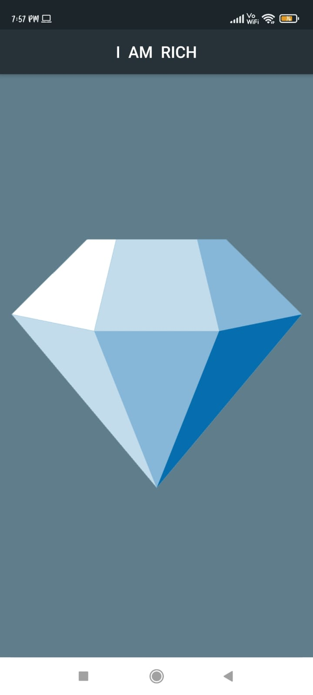

# i_am_rich_app :star_struck: :memo: :iphone: :notebook: 

[](https://shields.io/) [](https://shields.io/) [](https://shields.io/) [](https://shields.io/) [](https://shields.io/) [](https://shields.io/)

***This new flutter application 'i-am-rich-app' is created by Biswarup Bhattacharjee, student of BTECH, in University of Engineering and Management, Kolkata.***

**Email Id: bbiswa471@gmail.com.** 

**Contact No: 916290272740.** 


<p align="left">
<a href="https://www.facebook.com/profile.php?id=100070395300810" target="blank"></a>
<a href="https://instagram.com/biswarup2210" target="blank"></a>
<a href="https://github.com/biswa2210/biswa2210" target="blank"></a>
</p>

## About :point_down: 

<div align="justified">
     
This is a basic flutter app named 'I am Rich'. Here it is written 'I am rich' and a images is there of a DIAMOND.
     
</div>

## I AM RICH DEMO VIDEO: :point_right: <a href="https://www.youtube.com/watch?v=Jnhv7ZzW2To&list=PL0lbDlMJ1h4hiexZec5cbgw8a3F8dE1HH&index=3">Click here to watch</a>

## FLUTTER PLAYLIST: :point_right: <a href="https://www.youtube.com/playlist?list=PL0lbDlMJ1h4hiexZec5cbgw8a3F8dE1HH">Click here to watch</a>

## APP DOWNLOAD LINK : :point_right: <a href="https://drive.google.com/file/d/1Houem4HfBjeUS7w0fzGcRH03hl6ehvIL/view?usp=sharing" download>Click here to download</a>

## Purpose :point_down:

I have made this to practice flutter concepts.

## Folder Structure :point_down:
```bash
i-am-rich-app
     ├── lib
     |    └── main.dart
     └── test
          └── widget.test.dart
```     
                     
## Making :point_down:

This flutter application is totally responsive. I have used [FLUTTER](https://flutter.dev/?gclid=Cj0KCQjw38-DBhDpARIsADJ3kjliHdMH2hA97bBGqJtW5ORUUksCxpZ8cnrSWaH__HevGftAmP8AmvIaAhNlEALw_wcB&gclsrc=aw.ds) and [Dart](https://dart.dev/). I have loaded the entire app in main.dart.

## Getting Started :point_down: 

This project is a starting point for a Flutter application.

A few resources to get you started if this is your first Flutter project:

- [Lab: Write your first Flutter app](https://flutter.dev/docs/get-started/codelab)
- [Cookbook: Useful Flutter samples](https://flutter.dev/docs/cookbook)

For help getting started with Flutter, view our
[online documentation](https://flutter.dev/docs), which offers tutorials,
samples, guidance on mobile development, and a full API reference.

## Screenshots :point_down: 

<div align="center">
 
<a href="r.jpeg"></a> 

</div>


